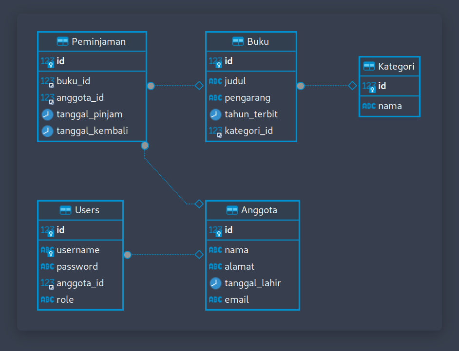

## :rice_scene: Pendahuluan
Assalamualikum wr.wb, Perkenalkan saya:
| Nama | NIM | Kelas |
| -- | -- | -- |
| **👦 : Rizky Nugraha Herliyanto** | 19104014 | SE-03-A |

## :star: Pembahasan

### :: Perpustakaan-CLI ::

Disini saya membuat program **CLI** menggunakan bahasa pemrograman **Python**
dengan nama **Perpustakaan-CLI**, pada intinya program sederhana ini
berfungsi untuk meminjam buku dan program ini juga sudah terkoneksi ke database **SQL**.

**Powered by:**

### :: ER Diagram ::

